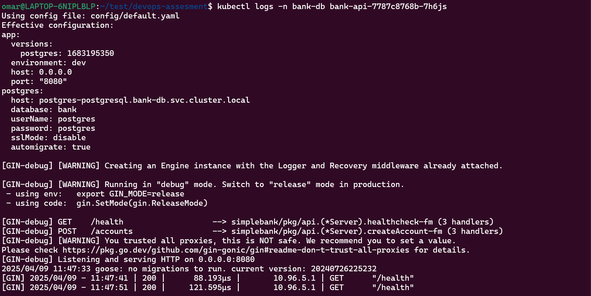

# DevOps Implementation Documentation

## Overview

This document outlines the DevOps implementation for the Bank Transaction API. The solution includes containerization with Docker, CI/CD pipelines with GitHub Actions, and Kubernetes deployment using Helm.


## Components

### 1. Docker Setup
- **Dockerfile**: Multi-stage build process that creates a minimal and secure runtime image
- **docker-compose.yml**: Local development environment with the application and PostgreSQL database


### 2. CI/CD Pipelines
- **Test Workflow**: Runs unit tests for the application code (manually triggered)
- **Docker Build Workflow**: Builds and pushes Docker images to GitHub Container Registry

### 3. Kubernetes Deployment
- **Helm Chart**: Complete deployment configuration for Kubernetes
  - 5 replicas as specified in the requirements
  - Node selector for proper placement
  - Pod anti-affinity to ensure high availability across different nodes
  - Resource limits and requests
  - Health checks



## Secure Handling of Sensitive Information

One of the key aspects of this implementation is the secure handling of sensitive information like database credentials.

### Approach

Instead of hardcoding credentials in the Helm values file, I've:

1. Used empty values in the `values.yaml` file:
   ```yaml
   postgresql:
     auth:
       # These will be overridden during deployment
       username: ""
       password: ""
   ```

2. Created a Kubernetes Secret to store database credentials:
   ```yaml
   apiVersion: v1
   kind: Secret
   metadata:
     name: bank-api-db-credentials
   type: Opaque
   stringData:
     BANK_POSTGRES_HOST: "postgres-postgresql.bank-db.svc.cluster.local"
     BANK_POSTGRES_PORT: "5432"
     BANK_POSTGRES_USERNAME: "postgres"
     BANK_POSTGRES_PASSWORD: "postgres"
     BANK_POSTGRES_DATABASE: "bank"
     BANK_MIGRATE: "true"
   ```

3. Configured the application to read these values from environment variables loaded from the Secret:
   ```yaml
   envFrom:
     - secretRef:
         name: bank-api-db-credentials
   ```

This way, the actual credentials are:
- Never stored in the Git repository
- Only provided at deployment time
- Stored securely in Kubernetes as secrets
- Accessible only to the pods that need them

## Local Development

For local development and testing:

1. Clone the repository
2. Run `docker-compose up`
3. The application will be available at http://localhost:8080

## CI/CD Workflows

### Docker Build Workflow
This workflow automatically builds and pushes Docker images to GitHub Container Registry when changes are pushed to the master branch or when a new tag is created.

### Test Workflow
The test workflow can be manually triggered from the GitHub Actions tab. It:
- Sets up a PostgreSQL database for testing
- Configures the application to connect to the test database
- Runs the unit tests against this environment

## Manual Deployment Process

To deploy the application:

1. Build and push the Docker image
2. Deploy the Helm chart with your database credentials:
   ```bash
   helm upgrade --install bank-api ./helm/bank-api \
     --namespace bank-api \
     --create-namespace
   ```